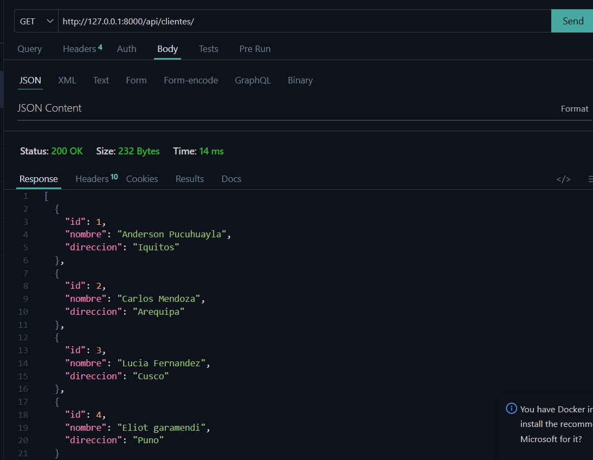
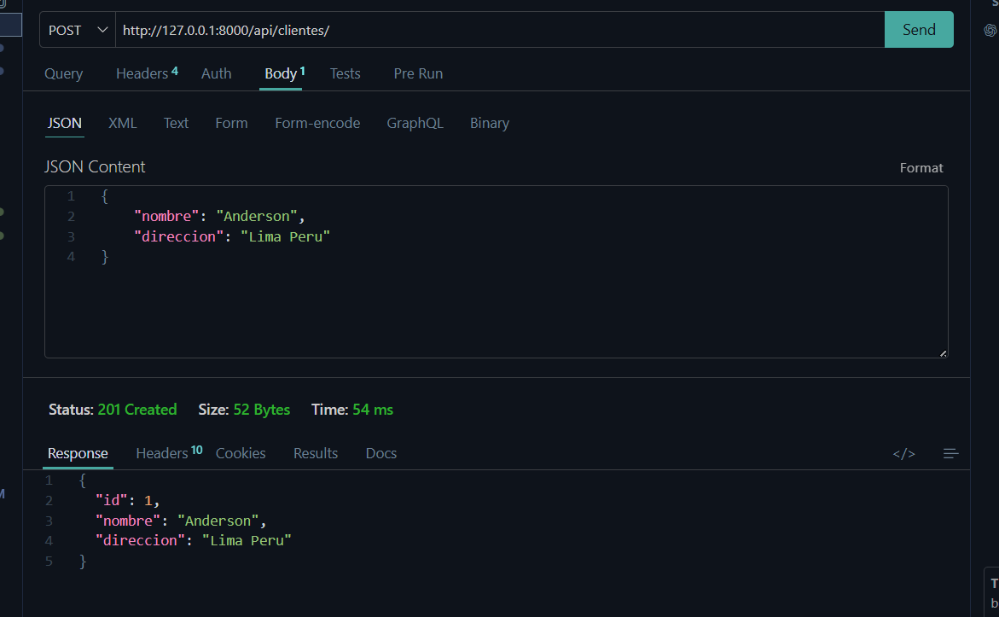
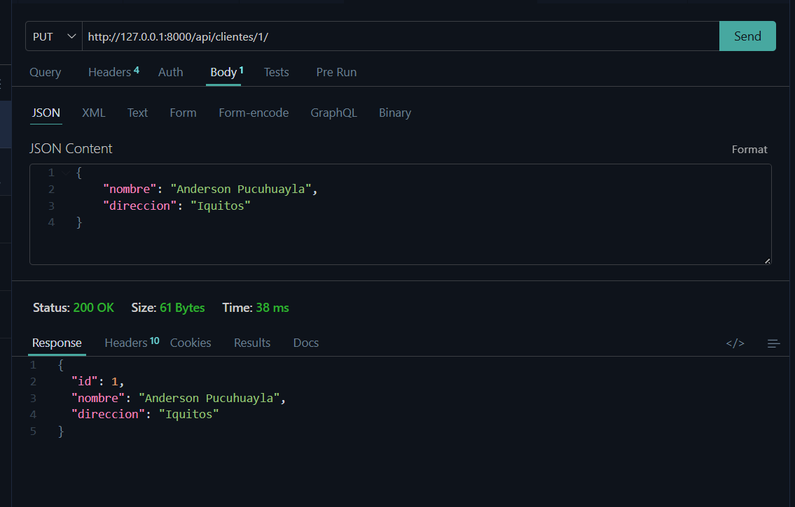
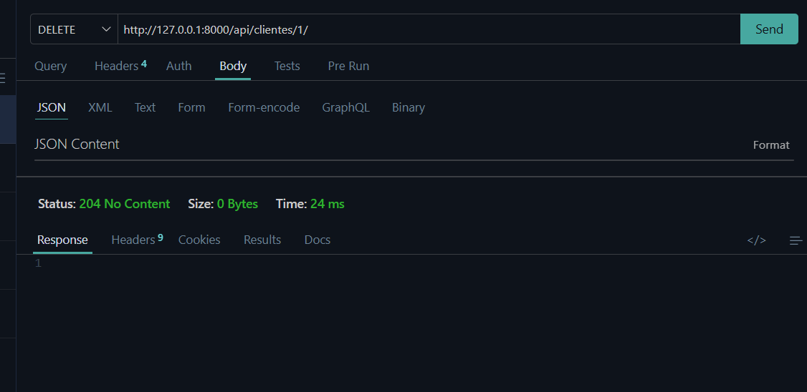
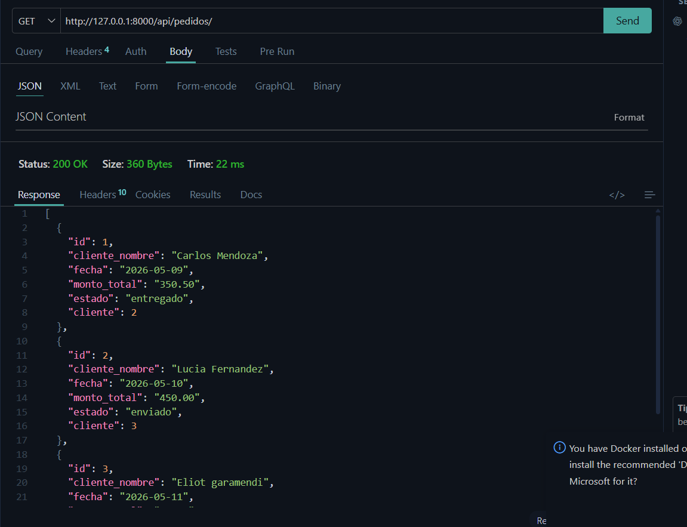
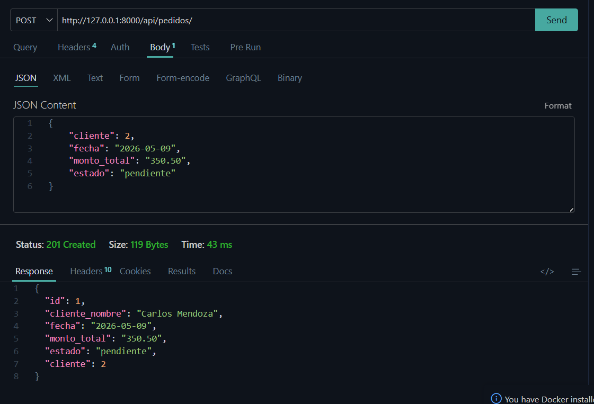
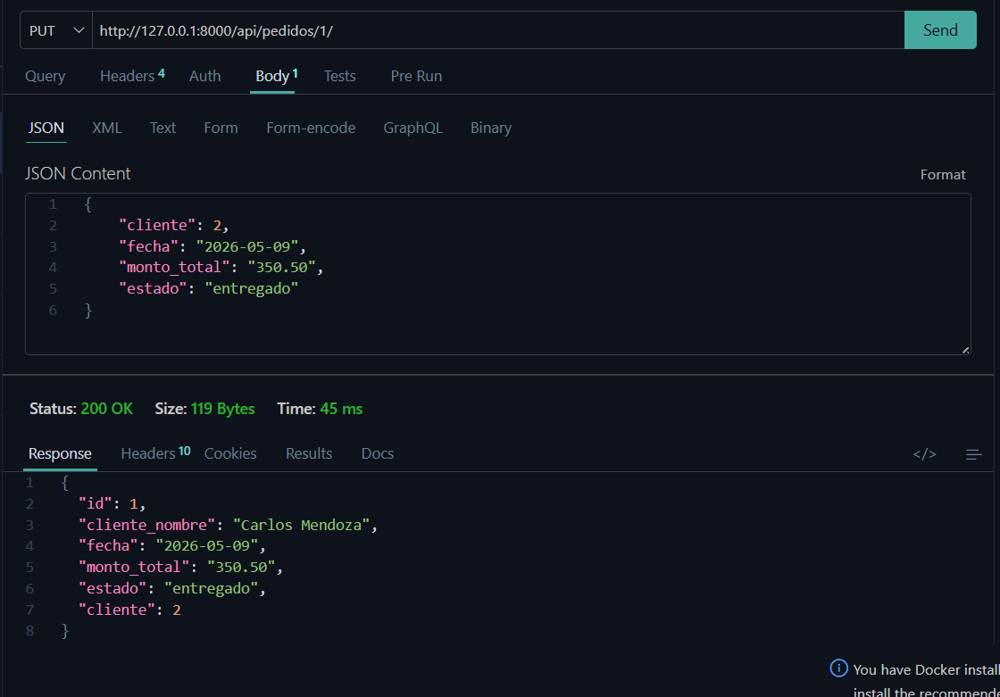
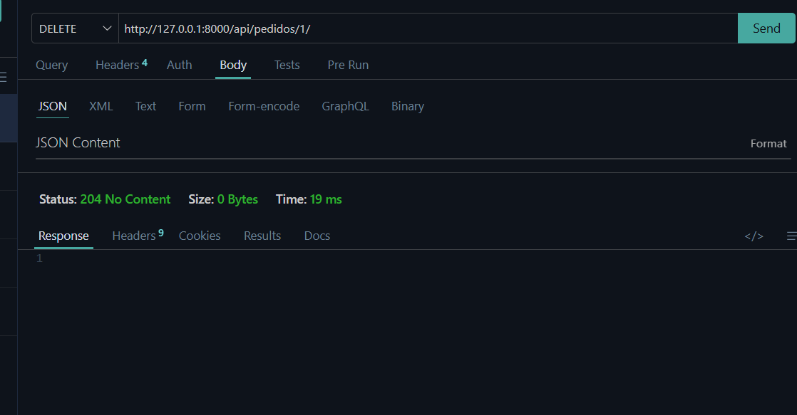
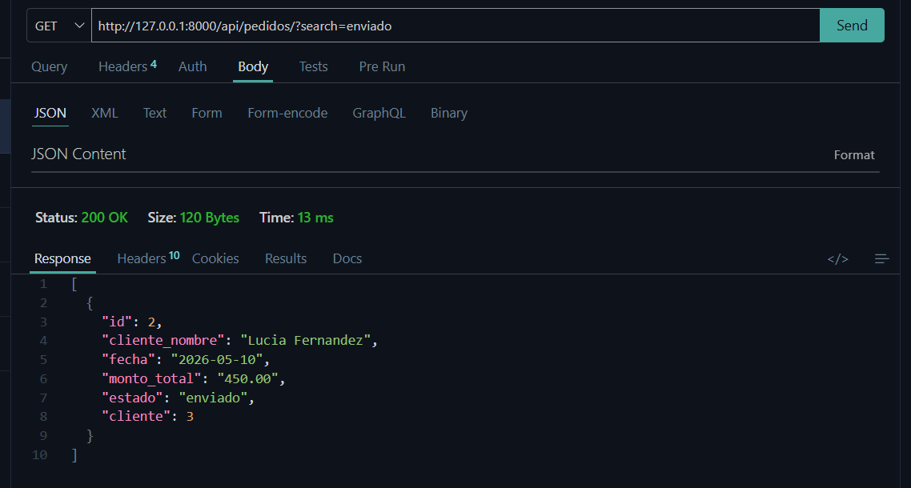
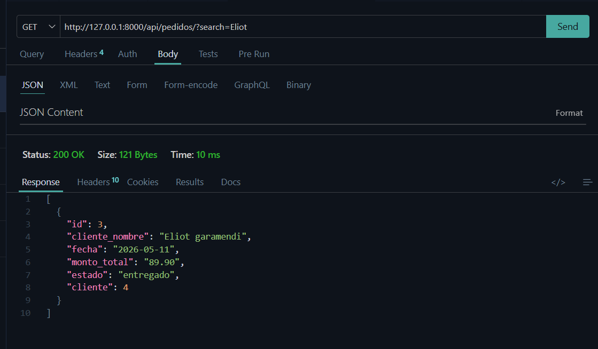

# 📦 Gestor de Pedidos API

API REST desarrollada con Django y Django REST Framework (DRF) para administrar pedidos y clientes.

Cada pedido está relacionado con un cliente y permite realizar operaciones CRUD completas mediante endpoints REST.

---

# Tecnologías Utilizadas

- Python
- Django
- Django REST Framework (DRF)
- SQLite
- Git & GitHub

---

# Instalación y Ejecución

## 1️⃣ Clonar repositorio

```bash
git clone https://github.com/Ingaxgaramendi/GESTION_PEDIDOS.git
```

---

## 2️⃣ Ingresar al proyecto

```bash
cd GESTION_PEDIDOS
```

---

## 3️⃣ Crear entorno virtual

```bash
python -m venv venv
```

---

## 4️⃣ Activar entorno virtual

### Windows

```bash
venv\Scripts\activate
```

---

## 5️⃣ Instalar dependencias

```bash
pip install django djangorestframework
```

---

## 6️⃣ Ejecutar migraciones

```bash
python manage.py makemigrations
python manage.py migrate
```

---

## 7️⃣ Ejecutar servidor

```bash
python manage.py runserver
```

---

# 🌐 Endpoints Disponibles

# Clientes

## 📃 Obtener clientes

```http
GET /api/clientes/
```

### Captura



---

## ➕ Crear cliente

```http
POST /api/clientes/
```

### Ejemplo JSON

```json
{
  "nombre": "Anderson",
  "direccion": "Lema-peru"
}
```

### Captura



---

## ✏️ Actualizar cliente

```http
PUT /api/clientes/1/
```

### Captura



---

## ❌ Eliminar cliente

```http
DELETE /api/clientes/1/
```

### Captura



---

# 📦 Pedidos

## 📃 Obtener pedidos

```http
GET /api/pedidos/
```

### Captura



---

## ➕ Crear pedido

```http
POST /api/pedidos/
```

### Ejemplo JSON

```json
{
  "cliente": 2,
  "fecha": "2026-05-09",
  "monto_total": "350.50",
  "estado": "pendiente"
}
```

### Captura



---

## ✏️ Actualizar pedido

```http
PUT /api/pedidos/1/
```

### Captura



---

## ❌ Eliminar pedido

```http
DELETE /api/pedidos/1/
```

### Captura



---

# 🔍 Búsqueda de Pedidos

La API permite buscar pedidos por estado o nombre del cliente.

## Endpoint

```http
GET /api/pedidos/?search=enviado
```

o

```http
GET /api/pedidos/?search=Eliot
```

### Capturas





---

# 🔗 Relación entre Pedidos y Clientes

Cada pedido pertenece a un cliente mediante una relación ForeignKey.

Además, se personalizó la respuesta del endpoint para mostrar el nombre del cliente directamente en el JSON.

## Ejemplo de Respuesta

```json
[
  {
    "id": 1,
    "cliente": 2,
    "cliente_nombre": "Carlos Mendoza",
    "fecha": "2026-05-09",
    "monto_total": "350.50",
    "estado": "pendiente"
  }
]
```

---

# ✅ Funcionalidades Implementadas

- CRUD completo de clientes
- CRUD completo de pedidos
- Relación entre pedidos y clientes
- Búsqueda con filtros
- Serializers
- ViewSets
- Routers
- Endpoints REST
- Personalización de respuestas JSON
- Historial de commits progresivos

---

# 👨‍💻 Autor

## Anderson Rivera
